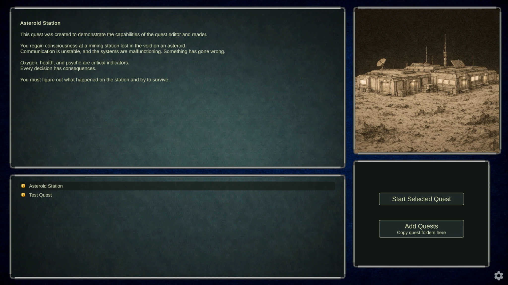
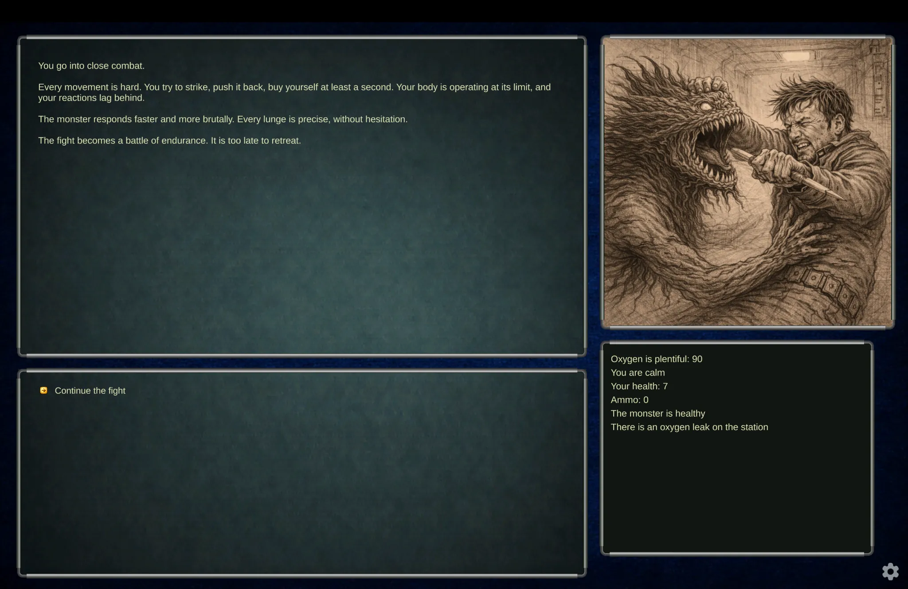
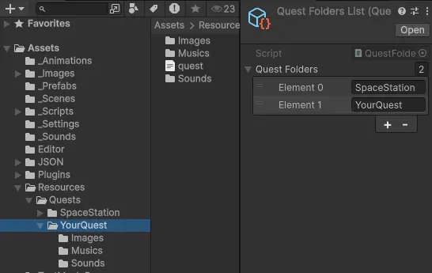

[English](README.md) | [Українська](README.ua.md) | [Русский](README.ru.md)

# Text Quest Reader


A text quest reader for running branching narrative quests, inspired by the mechanics of the game "Space Rangers".

Together with the [Quest Editor](https://github.com/albruevich/QuestEditor_Builds) tool, it forms a system for creating and running custom text quests.

Unlike the original editor and similar systems tied to a specific game or platform, this system allows you to use custom quests in any project.

Supports location logic, transitions, parameters, as well as images and sounds.

---

## Demo




---

## About the Project

The project is written in C# using Unity.

It is open source and can be used:
- to play the included quest "Asteroid Station"
- to see how quests generated by the Quest Editor can be used in practice
- as a base for creating your own text quest reader with a custom UI

---

## Quest Structure

Each quest is stored as a separate folder inside:

Assets/Resources/Quests/

Inside this folder, each quest has its own directory:

YourQuest/

### Contents

- `quest.json` — main quest file (contains all logic and data, mandatory)
- `Images/` — images used in the quest (optional)
- `Sounds/` — sound effects (optional)
- `Musics/` — background music (optional)

If the optional folders are empty, the quest will still work with text and logic, but without images and sounds.

⚠️ This structure is automatically generated by the Quest Editor. You do NOT need to create it manually.

To use a quest:
1. Place its folder into `Assets/Resources/Quests/`
2. Add the quest folder name to `_Settings/Quest Folders List`

After that, the reader will detect and load the quest.

The structure looks like this:



---

## Important

The quest name inside `quest.json`:

```json
"questName": "YourQuest"
```

must match the name of the quest folder.

---

## How to Run

1. Open the project folder in Unity Hub  
   (the folder that contains `Assets`, `Packages`, and `ProjectSettings`)

2. Open the main scene:

Assets/_Scenes/MainScene.unity

3. Press Play

---

## Quick Test

After pressing Play:
- select a quest (e.g. "Asteroid Station")
- press "Start Selected Quest"

If everything works — the quest will start.

---

## Downloads

Ready-to-use builds are available on the [Releases](https://github.com/albruevich/QuestReader/releases) page.

### How to download and run

1. Open the Releases page  
2. Download the archive for your platform  
3. Extract it  
4. Run the executable file

---

## Creating Quests

Quests are created using a separate tool — [Quest Editor](https://github.com/albruevich/QuestEditor_Builds).

👉 The editor repository contains full documentation on how to create and export quests.

The editor allows you to visually create parameters, locations, transitions, and quest structure, and then export the quest as a ready-to-use folder that can be used directly with this reader.

---

## Localization

The reader supports multiple languages.

You can add files like:
- `quest_en.json`
- `quest_uk.json`

If a localized file is missing — `quest.json` will be used.

See and edit `Localization.cs`, `LocKeys.cs`, `SettingsPanel.prefab`, `SettingsPanel.cs`

---

## Requirements

### Run from source (Unity project)
- Unity 6.2

### Run prebuilt builds (Releases)
- No installation required

---

## Assets

Some images in this project were generated using AI tools.

Sound effects and music are sourced from [Pixabay](https://pixabay.com/).

---

## License

MIT
