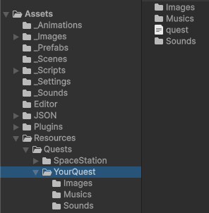

[English](README.md) | [Українська](README.ua.md) | [Русский](README.ru.md)

# Text Quest Reader


A text quest reader inspired by the mechanics of the game "Space Rangers".

Together with the [Quest Editor](https://github.com/albruevich/QuestEditor_Builds) tool, it forms a system for creating and running custom text quests.

Supports location logic, transitions, parameters, as well as images and sounds.

---

## Demo


---

## About the Project

The project is written in C# using Unity.

It is open source and can be used:
- to play the included quest "Asteroid Station"
- to see how quests generated by the Quest Editor can be used in practice
- as a base for creating your own text quest reader with a custom UI

---

## Quest Structure

Each quest is stored as a separate folder inside:

Assets/Resources/Quests/

Inside this folder, each quest has its own directory:

YourQuest/

The structure looks like this:



### Contents

- `quest.json` — main quest file (contains all logic and data, mandatory)
- `Images/` — images used in the quest (optional)
- `Sounds/` — sound effects (optional)
- `Musics/` — background music (optional)


If optional folders are missing, the quest will still work with text and logic only.

⚠️ This structure is automatically generated by the Quest Editor.  
You do NOT need to create it manually.

To use a quest, simply place its folder into:

Assets/Resources/Quests/

The reader will detect it automatically.

💡 Example:  
Assets/Resources/Quests/AsteroidStation/


---

## Important

The quest name inside `quest.json`:

```json
"questName": "YourQuest"
```

must match the name of the quest folder.

---

## How to Run

1. Open the project folder in Unity Hub  
   (the folder that contains `Assets`, `Packages`, and `ProjectSettings`)

2. Open the main scene:

Assets/_Scenes/MainScene.unity

3. Press Play

---

## Quick Test

After starting the game:
- select a quest (e.g. "Asteroid Station")
- press "Start Selected Quest"

If everything works — the quest will start.

---

## Builds

Ready-to-use builds are located in the `_Builds` folder.

---

## Creating Quests

Quests are created using a separate tool — Quest Editor.

👉 Editor repository: https://github.com/albruevich/QuestEditor_Builds

The editor allows you to visually create parameters, locations, transitions, and quest structure, and then export it to a format compatible with this reader.

---

## Localization

The reader supports multiple languages.

You can add files like:
- `quest_en.json`
- `quest_uk.json`

If a localized file is missing — `quest.json` will be used.

See and edit `Localization.cs`, `LocKeys.cs`, SettingsPanel.prefab

---

## Requirements

Unity 6.2

---

## Assets

Some images in this project were generated using AI tools.

Sound effects and music are sourced from Pixabay:
https://pixabay.com/

---

## License

MIT
